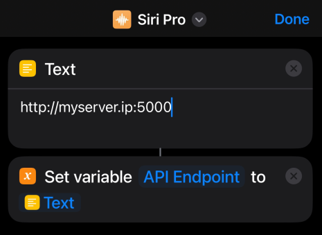

# Siri Pro

An improved Siri, working with Anthropic Claude.

# Run

First, fill in the `.env.example` file and rename it to `.env`
An Anthropic API Key is required. Get it here: https://console.anthropic.com/login

Second, you have to install requirements and run the server.

```shell
pip3 install -r requirements.txt
python3 server.py
```

Make sure the server is reachable for your iPhone. You can try open browser and enter the IP address.

Third, download the Shortcut script:
https://www.icloud.com/shortcuts/4ec5ebf6e5fc48f1b6039a89a6977312

Fourth, fill in the server IP



Now you can run it!
